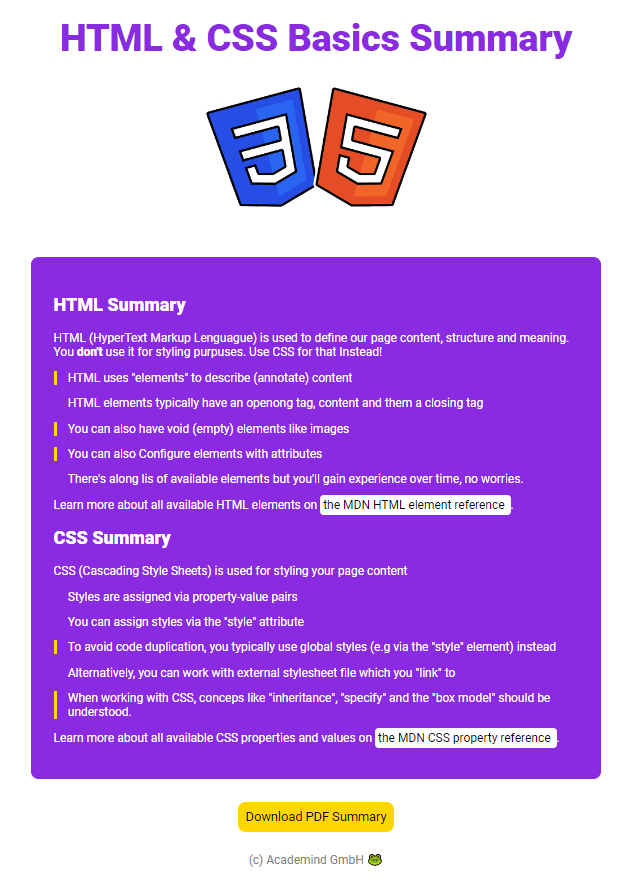

# HTML & CSS Basics Summary

This is the fisty page i made by my own using HTML and CSS, froma  course im taking in udemy. 

## Table of contents

- [Overview](#overview)
  - [Screenshot](#screenshot)
  - [Links](#links)
- [My process](#my-process)
  - [Built with](#built-with)
- [Author](#author)

## Overview

### Screenshot

### Links

- Live Site URL: [https://morbitdemon.github.io/HTML-CSS-Basics-Summary/]

## My process

- I focused on the structure of the page first.
- Once i finished with html i went to styling my page with CSS.

### Built with

- Semantic HTML5 markup
- CSS custom properties

## Author

 [@MorbitDemon](https://www.frontendmentor.io/profile/MorbitDemon)
